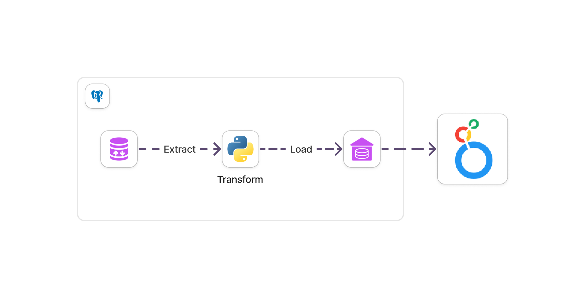

# About this Project

Perform data extraction from `OLTP` then we move the data from OLTP to `Datawarehouse` and then connect Datawarehouse to `Looker` to create `Dashboards`.



## How to use this Project ?
Make sure you change requirement connections
```pycon
# Required Connection
USER = os.environ.get('USER')
PASSWORD = os.environ.get('PASSWORD')
HOST = os.environ.get('HOST')
DWH = os.environ.get('DWH')
OLTP = os.environ.get('OLTP')
```
## You can modify this project in the file `config.py`
You can see the file in [config.py](https://github.com/Ghifariezra/data-engineer/blob/f052e6a6e14ac1b9165b926c904611f9db8c73cd/Digital%20Skola/Project/etl-project/etl/config/config.py)

### Final Result
You can find it in [DASHBOARD-RESULT](etl/dashboard/dashboard_project1.pdf)